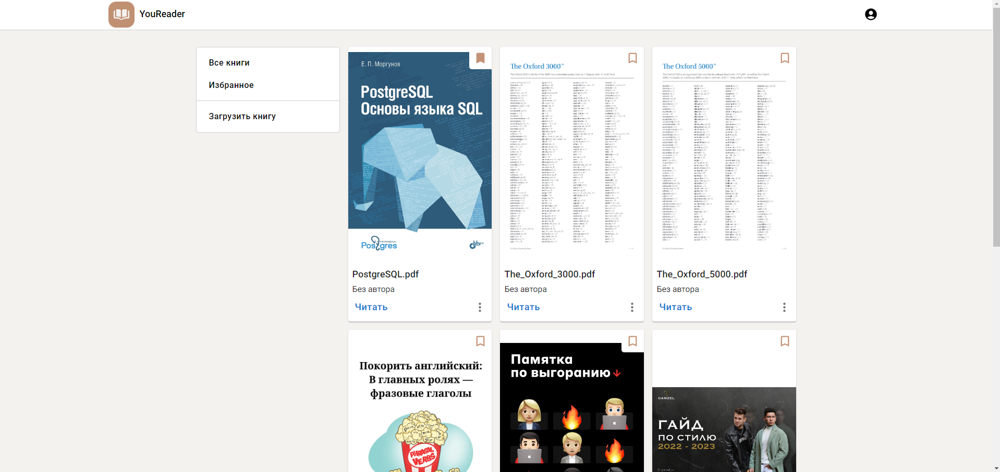

 # YouReader - frontend

<p align="center">
    
</p>

Frontend of YouReader application for reading pdf books with synchronization. If you want to see the backend of YouReader - follow the [link](https://github.com/DaniilSintsov/you-reader-backend)

## Screenshots



Other screenshots you can see in the `screenshots` folder

## Features

- registration and authorization
- uploading a pdf file to the server
- adding the book to favorites
- synchronization of reading progress
- view document table of contents
- thumbnail view of document pages

## Build and run

To build the frontend

```sh
npm run build
```

Run the frontend

```
npm run start
```